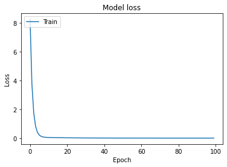

---
title: "Linear Regression의 cost 최소화 TensorFlow 구현"
type: post
permalink: /study/ai/ML_Lab_03
category: 
    - STUDY
        - etc
tag:
    - AI
use_math: true
toc: ture
siderbar_main: true
---
본 글은 [모두를 위한 머신러닝/딥러닝 강의](https://hunkim.github.io/ml/)를 참고하여 작성하였습니다.  
소스 코드는 [DeepLearningZeroToAll](https://github.com/hunkim/DeepLearningZeroToAll)를 참고 하여 작성하였습니다.

# ML lab 03 - Linear Regression의 cost 최소화의 TensorFlow 구현
[Linear Regression cost함수 최소화](https://hodurie.github.io/study/ai/ML_Lec_03)에서 다루었던 내용을 TensorFlow로 구현해 보겠습니다.  

여기서 사용할 가설과 수식은  

$$ H(x) = Wx $$

$$
\mathbf{cost}(W) = { {1} \over {m} } \sum_{i = 1}^m (H(x_i) - y_i)^2 $$

이와 같습니다.


 ## Minimizing Cost
 여기서 `matplotlib`는 그래프를 그려주는 라이브러리 입니다.  


```python
import numpy as np
import tensorflow as tf
import matplotlib.pyplot as plt

x_train = [1, 2, 3, 4]
y_train = [0, -1, -2, -3]
```


```python
tf.model = tf.keras.Sequential()
tf.model.add(tf.keras.layers.Dense(units = 1, input_dim = 1))
```


```python
sgd = tf.keras.optimizers.SGD(lr = 0.1)
tf.model.compile(loss='mse', optimizer = sgd)
tf.model.summary()
```

    Model: "sequential"
    _________________________________________________________________
    Layer (type)                 Output Shape              Param #   
    =================================================================
    dense (Dense)                (None, 1)                 2         
    =================================================================
    Total params: 2
    Trainable params: 2
    Non-trainable params: 0
    _________________________________________________________________
    

`mse`는 **Mean squared error**로,  
우리가 위에서 가정한  
$$\mathbf{cost}(W) = { {1} \over {m} } \sum_{i = 1}^m (H(x_i) - y_i)^2 $$  

의 식을 적용하겠다는 의미입니다.


```python
history = tf.model.fit(x_train, y_train, epochs = 100)
```


```python
y_predict = tf.model.predict(np.array([5, 4]))
print(y_predict)
```

    [[-3.9771595]
     [-2.9882479]]
    

### Making plot


```python
plt.plot(history.history['loss'])
plt.title('Model loss')
plt.ylabel('Loss')
plt.xlabel('Epoch')
plt.legend(['Train', 'Test'], loc = 'upper left')
plt.show()
```




