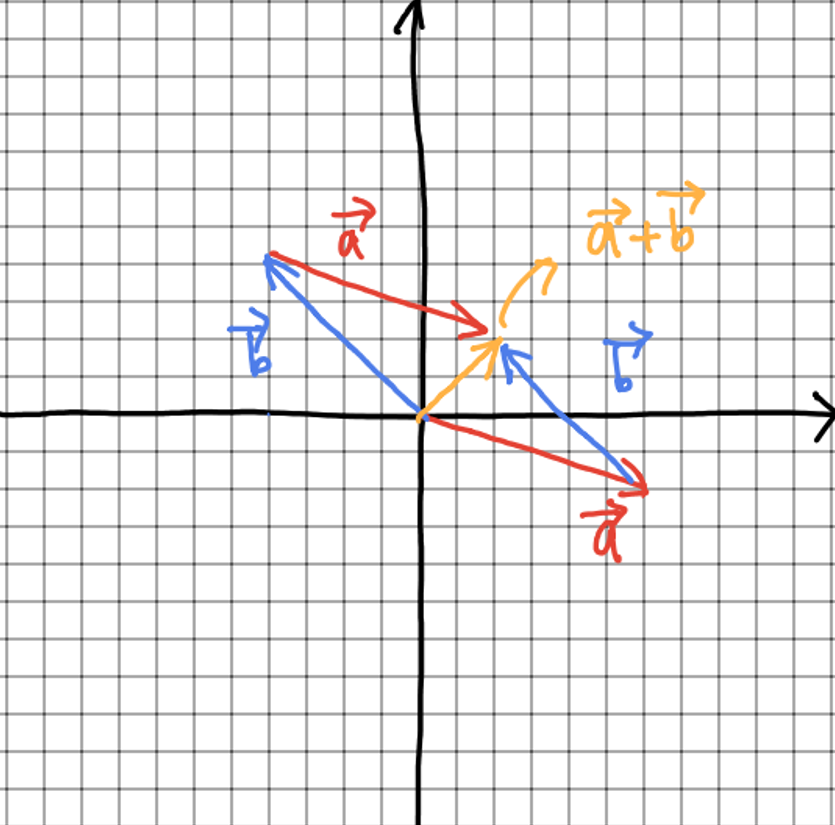
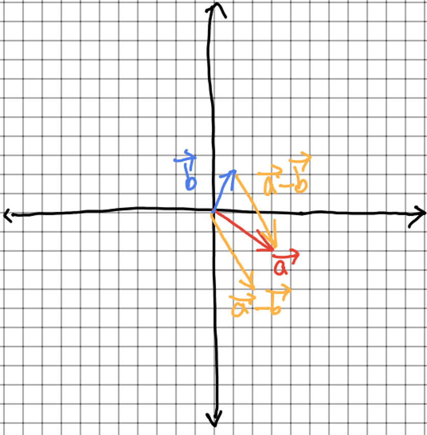

본 글은 edwith [[칸아카데미] 모두를 위한 선형대수학](https://www.edwith.org/linear-algebra/lecture/30304/)를 참고하여 작성하였습니다.
# 선형 대수학 - 01. 벡터
## 선형 대수학
- 벡터 공간, 벡터, 선형 변환, 행렬, 연립 선형 방정식을 연구하는 대수학의 한 분야

## 벡터  
- 벡터 공간의 원소
> 벡터 공간이란?    
> 선행 대수학에서 원소를 서로 더하거나,  
> 주어진 배수로 늘이거나 줄일 수 있는 공간

- 방향과 속도를 갖는 값  
- 속도만 갖고 방향을 갖지 않는 값은 스칼라  
- 위치와 상관없이, 방향과 속도가 같으면 동일한 벡터
- 변수로 사용할 경우 알파벳 위에 화살표를 표현함 
$\vec{v} = (x, y) = 
\left[\begin{array}{r}
x\\
y
\end{array}\right]
$

## 실좌표 공간
- $\mathbb{R}^n$ 또는 <strong>$\mathbf{R}^n$</strong>은 $n$차원 실수 좌표 공간을 나타냄
- $\mathbb{R}^n$은 $n$의 값을 갖는 튜플
> 튜플이란?  
> 순서가 정해진 셀 수 있는 값들을 열거한 값으로,  
> $n$개의 요소를 가지면 <strong>$n$-튜플</strong>이라 한다.  
- $\vec{x} = (0, 1)$ 실수 값을 갖는 다면 $\vec{x} \in \mathbb{R^2}$ 
- $\vec{x} = (-i,i)$ 허수의 값을 갖는 다면, $\vec{x} \notin \mathbb{R^2}$

## 대수와 그래프를 이용한 벡터의 덧셈
$\vec{a} ,  \vec{b} \in\mathbb{R^2}$ 이고,  
$\vec{a} = (6, -2),  \vec{b} = (-4, 4)$ 일 때  
$\vec{a} + \vec{b} = (6 + (-4), (-2) + 4) = (2, 2)$  

## 벡터와 스칼라의 곱셈
- 벡터에 스칼라 곱을 하면 각 원소에 스칼라 값을 곱한 값과 같다.  
$\vec{a} \in\mathbb{R^2}$ 이고,   
$\vec{a} = (2, 1)$   
$3\vec{a} = (3*2, 3*1) = (6, 3)$  
- 벡터에 양수 스칼라곱은 방향을 유지한 채 크기만 스칼라배 해준다.  
- 벡터에 음수 스칼라곱은 벡터의 정반대 방향으로 스칼라배 해준다.  

## 대수와 그래프를 이용한 벡터의 뺄셈
$\vec{a} ,  \vec{b} \in\mathbb{R^2}$ 이고,  
$\vec{a} = (3, -2),  \vec{b} = (1, 2)$ 일 때  
$\vec{a} - \vec{b} = (3 - 1, (-2) - 2) = (2, -4)$  

- 벡터1 - 벡터2 를 하게 되면, 각 벡터의 끝점을 이은 선분이 된다.
- 두 벡터의 뺼셈의 방향은 벡터1의 끝점을 향하게 한다.

## 단위 벡터
- 길이가 1인 벡터
- 벡터 $v$와 방향이 같은 벡터는 $\hat{v}$로서 표기한다.
$\vec{v} \in \mathbb{R}^2$에서  
$\vec{v} = (2, 3)$ 이라 할 때,  
$\vec{v}$는 $x$ 축으로 2, $y$ 축으로 3만큼 갔다고 할 수 있다.  
이때, 길이가 1인 단위 벡터가 있다고 하자.  
$\hat{i}$는 $x$ 축으로 1만큼 $y$ 축으로는 0만큼  
$\hat{j}$는 $x$ 축으로 0만큼 $y$ 축으로는 1만큼   
즉,  
$\hat{i} = (1, 0) \\ \hat{j} = (0, 1)$   
와 같이 표기하면, $\vec{v}$ 는 위의 단위 벡터의 스칼라 배를 한 단위 벡터의 합으로 표현 할 수 있다.   
$\vec{v} = 2\hat{i} + 3\hat{j}$  

## 직선의 매개변수 표현
- 매개변수, 파라미터, 모수는 함수의 특정한 성질을 나타내는 변수이다.
- $\theta$로 표시한다.
$\vec{v} \in \mathbb{R}^2$이고,  
$\{c\vec{v} | c \in \mathbb{R}\}$ 일 때,  
영점을 기준으로 $\vec{v}$에 $c$를 무한하게 곱하게 되면,  
하나의 직선이 나오게 된다.  
이를, $\vec{x} \in \mathbb{R}^2$인  
$\vec{x}$ 만큼 이동하게 되면,  
위의 값을 $y = ax + b$로 일반화 할 수 있다.  
이를 두 개의 벡터를 이용해 일반화 하게 되면,  
$\vec{a}, \vec{b} \in \mathbb{R}^2$ 이고,    
$\{t|t \in \mathbb{R} \}$ 일 때  
$\vec{a} - \vec{b}$를 $t$ 배 한 직선을 원 점으로 옮기면,  
이를 이와 같이 일반화 할 수 있다.  
$L = \{\vec{a} + t(\vec{b} - \vec{a}) | t \in \mathbb{R}^2\}$  또는  
$L = \{\vec{b} + t(\vec{b} - \vec{a}) | t \in \mathbb{R}^2\}$  
여기서 특정 위치의 $x, y$의 좌표를 구하려면,  
각 원소들의 합들로 나타낼 수 있다.  
